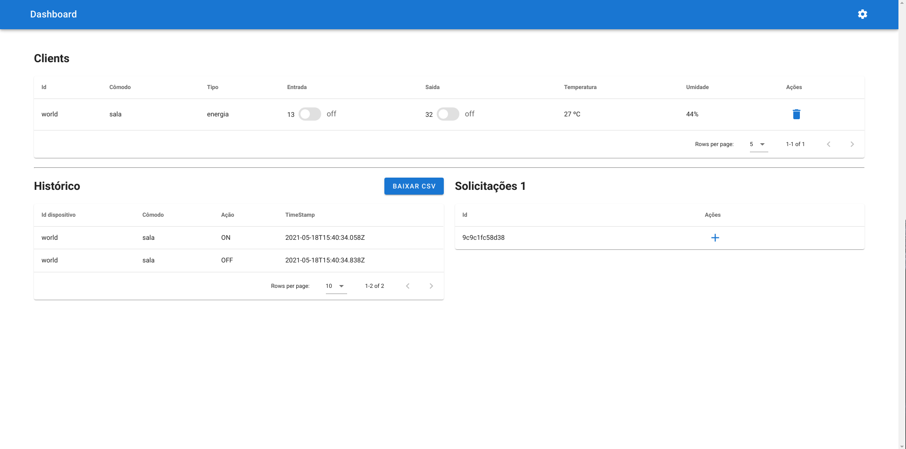

## Projeto 3 - 2020/2 - FSE

| Aluno | Matricula |
|--|--|
|Elias Bernardo Marques Magalhães| 150009011 |
|Leonardo dos Santos Silva Barreiros | 150135521 | 

O objetivo deste trabalho é criar um sistema distribuído de automação residencial utilizando um computador (PC) como sistema computacional central e placas ESP32 como controladores distribuídos, interconectados via Wifi através do protocolo MQTT.

## Compilação e utilização

Instruções mais detalhadas se encontram no readme das pastas __central/__ e __distribuido_*/__
